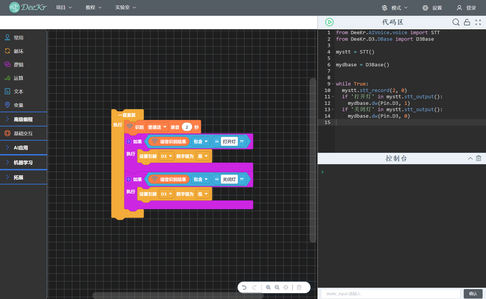

.. Deekr软件使用手册 documentation master file, created by
   sphinx-quickstart on Fri Nov 11 22:32:22 2022.
   You can adapt this file completely to your liking, but it should at least
   contain the root `toctree` directive.

Deekr软件使用手册
=============================================

DeeKr平台是一款面向中小学生进行AIOT（人工智能+物联网）教学和创作的软件平台啊。

.. toctree::
   :maxdepth: 20
   :caption: 目录:
   
   一、项目菜单栏/index
   二、教程菜单栏/index
   三、AI体验平台/index
   四、AI原理实验平台/index
   五、AI模型训练平台/index
   六、更多应用（实验室）/index
   七、AI交互编程模式/index
   八、硬件编程模式/index
   九、Python编程模式/index
   十、教师中心/index
   十一、学生中心/index
   十二、软件版本更新/index
   
   
   

