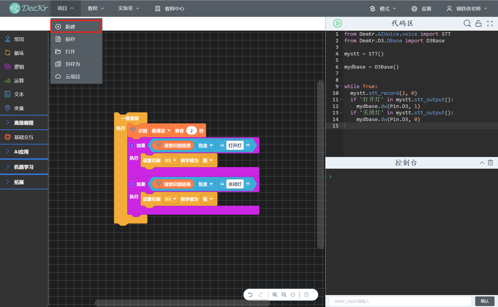

1.新建本地项目
============================
点击“项目菜单栏”中的“新建”，输入项目名称，选择项目保存目录，项目类型为“本地项目”；若需要新建空白项目时选择“新建空白项目”，若需要将已有代码保存到新项目时选择“保留当前代码”。
   

2.保存本地项目
===========================
点击“项目菜单栏”中的“保存”，即可将代码保存到已新建的项目。

3.打开本地项目
=================================
点击“项目菜单栏”中的“打开”，选择文件保存路径，即可打开程序文件。

4.本地项目另存为
=================================
点击“项目菜单栏”中的“另存为”，输入新的项目名称，选择文件保存路径。
   

5.新建云项目
=================================
新建云项目需要登录账号；点击“项目菜单栏”中的“新建”，输入项目名称，项目类型选择“云项目”，若需要新建空白项目时选择“新建空白项目”，若需要将已有代码保存到新项目时选择“保留当前代码”。
   

6.保存云项目
=================================
保存云项目需要登录账号；点击“项目菜单栏”中的“保存”，即可将代码保存到已新建的云项目。
   

7.打开云项目
=================================
打开云项目需要登录账号；点击“项目菜单栏”中的“云项目”，即可显示云项目列表；选择项目后点击对应的“载入”按钮，即可打开云项目。
   

8.管理云项目
=================================
管理云项目需要登录账号；点击“项目菜单栏”中的“云项目”，即可显示云项目列表；选择项目后点击对应的“编辑”按钮，即可编辑该云项目的项目名称和项目描述；选择项目后点击对应的“删除”按钮，即可删除该云项目。
   

.. figure:: 14.管理云项目3.png
  
