.. toctree::
  :maxdepth: 11

点击“模式菜单栏”中的“AI交互编程”，即可进入AI交互编程模式；AI交互编程模式运行于电脑的Python环境；AI交互编程模式下的硬件拓展项目，运行时需要将硬件通过USB线连接到电脑进行数据交互。

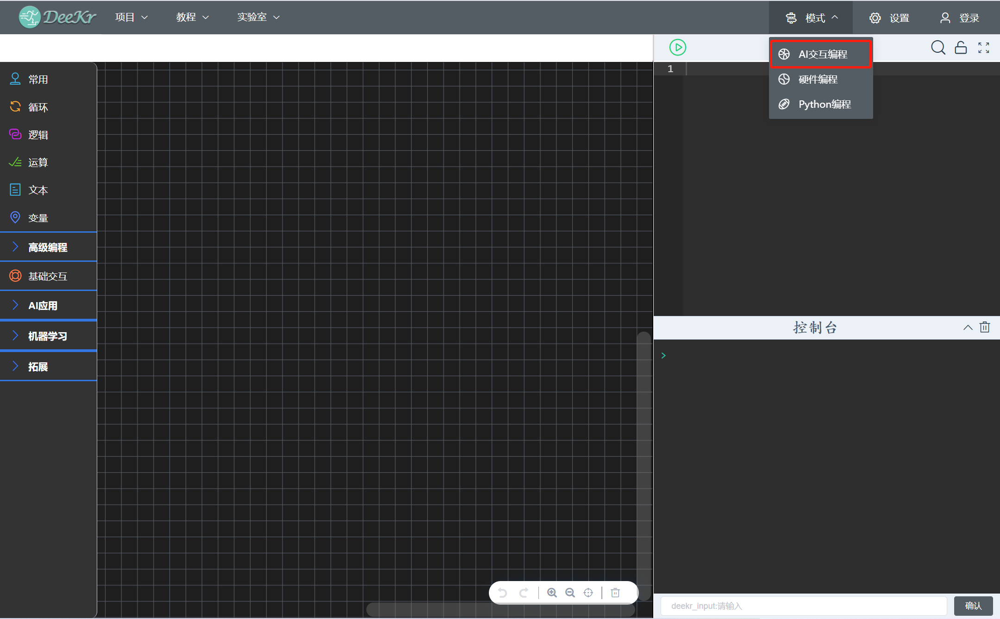

1.图形化编程
======================
图形化编程积木划分为“基础编程积木”、“高级编程积木”、“基础交互积木”、“AI应用积木”、“机器学习积木”、“硬件拓展积木”；
（1）“高级编程”可展开“函数”、“列表”、“元组”、“集合”、“字典”等积木类型；
（2）“AI应用”可展开“语音技术”、“图像识别”、“人脸识别”、“文字识别”、“姿态识别”、“NLP”等积木类型；
（3）“机器学习”可展开“线性回归”、“KNN分类”、“无监督学习”等积木类型；
（4）“拓展”可选择导入“D3控制器”、“Arduino UNO”、“micro:bit”等硬件积木类型。

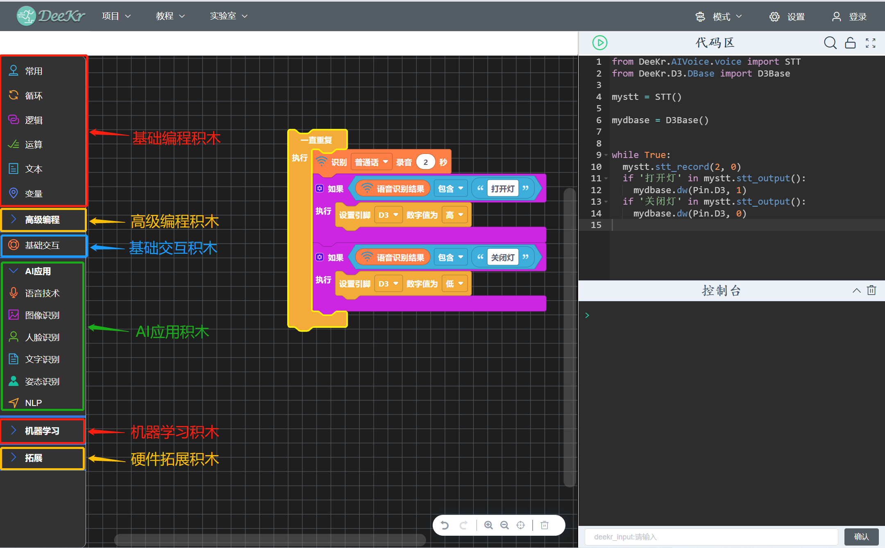

带网络标识的积木使用时电脑需要连接网络，不带网络标识的积木使用时电脑不需要连接网络。

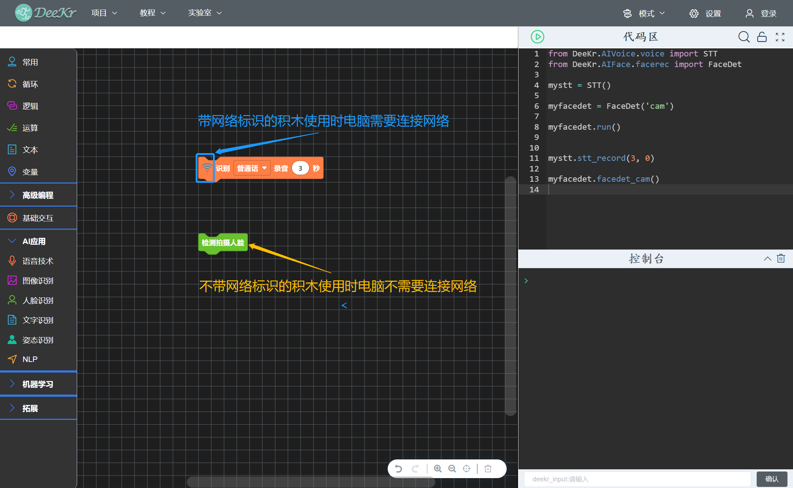

在“拓展—硬件”中选择硬件类型，即可导入该硬件类型的编程积木。

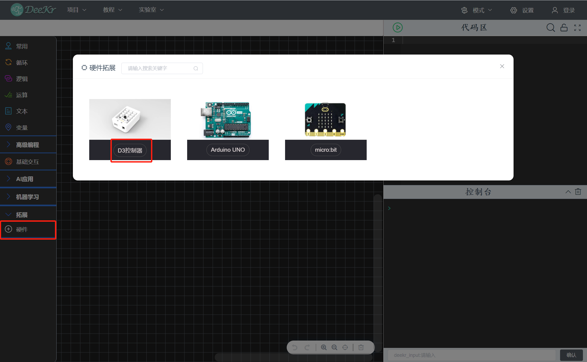
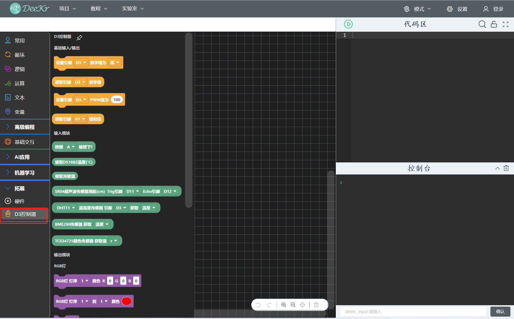

积木编程区右下角的操作栏，支持“撤销”、“重做”、“放大”、“缩小”、“原始大小”、“删除”等操作。

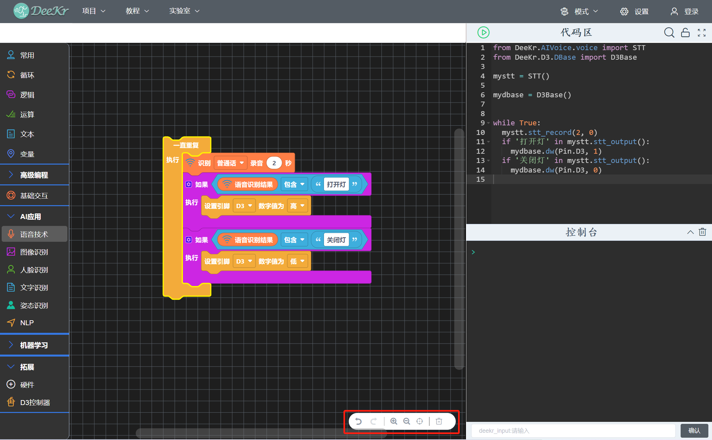

程序编写完成后，通过“程序运行”按钮即可运行程序；控制台显示程序运行时的输出信息；控制台下方的输入栏用于配合“input”函数使用，获取用户输入数据。

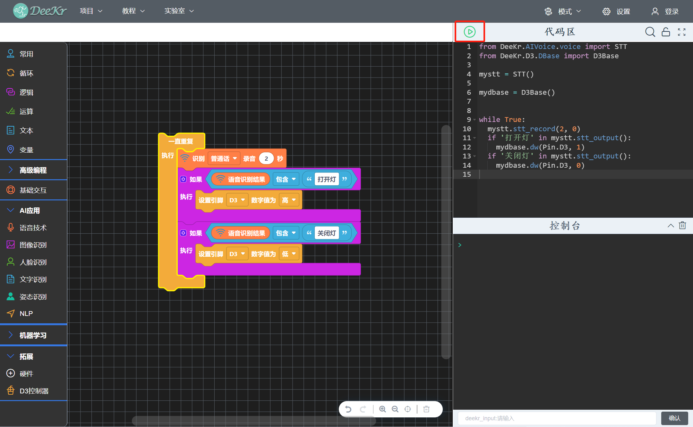

2.Python编程
========================
将图形化积木拖拽到积木编程区后，Python编程区自动生成对应的Python代码；在不进行图形化编程的情况下，可单独在Python编程区完成Python代码编程；通过Python编程区右上角按钮可进行“代码搜索”、“编程区锁定”（锁定状态下无法进行Python代码编程）、“代码区全屏”等操作。

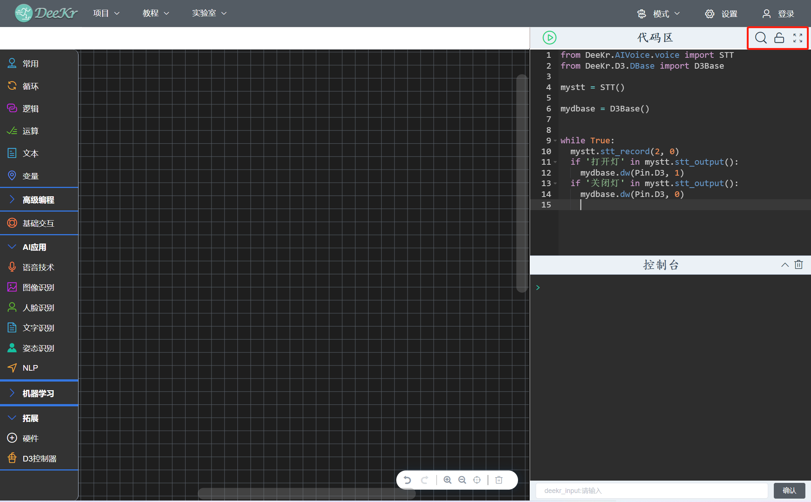
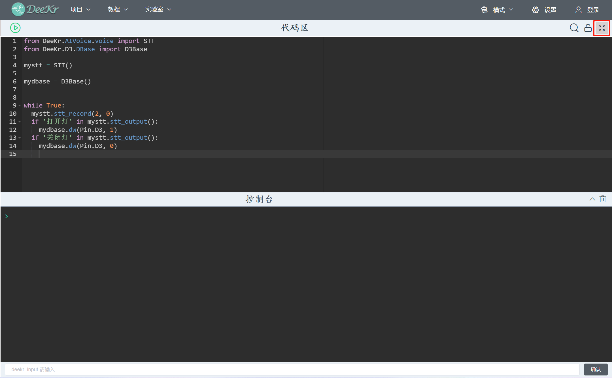

3.演示案例
=========================
可通过“教程菜单栏”中的“示例代码”，加载示例程序进行使用；此处阐述三个案例的使用：
（1）人脸识别（示例代码“计算机视觉——电子警察”）
点击人脸训练集“选择”按钮，通过文件导航器选择人脸数据集文件夹路径即可；该人脸数据集文件夹从“AI体验平台——人脸识别”中导出。

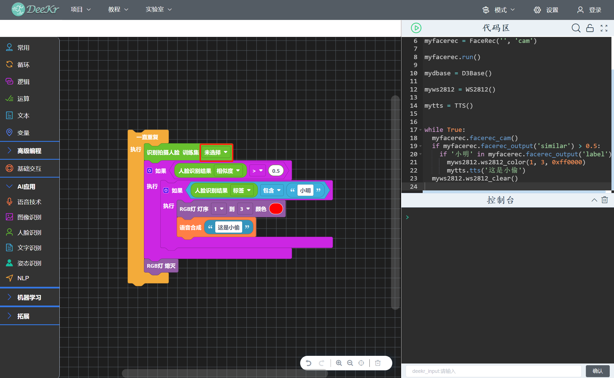

（2）图像分类模型推理（示例代码“计算机视觉——农作物病虫害识别仪”）
点击图像分类模型“选择”按钮，通过文件导航器选择模型文件夹路径即可；该模型文件从“AI模型训练平台——图像分类”中导出Keras模型（包含.h5模型文件和.txt标签文件），或者从下部分“图像分类模型训练”中通过编程方式训练图像分类模型。

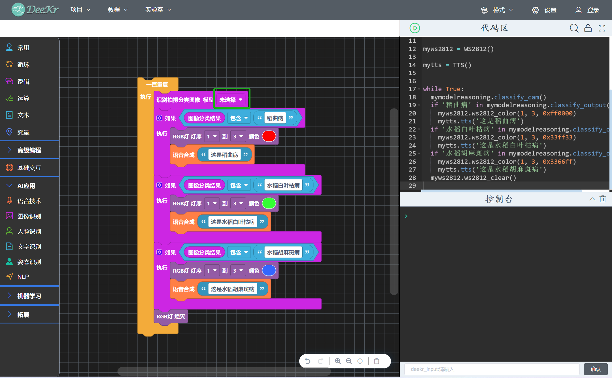

（3）图像分类模型训练（示例代码“计算机视觉——图像分类模型训练”）
点击图像分类训练集“选择”按钮，通过文件导航器选择图像训练集文件夹路径即可；该训练集文件夹可从“AI模型训练平台——图像分类”中导出采集数据；
点击图像分类模型保存“选择”按钮，通过文件导航器选择模型保存路径即可；模型保存后生成.h5模型文件和.txt标签文件。

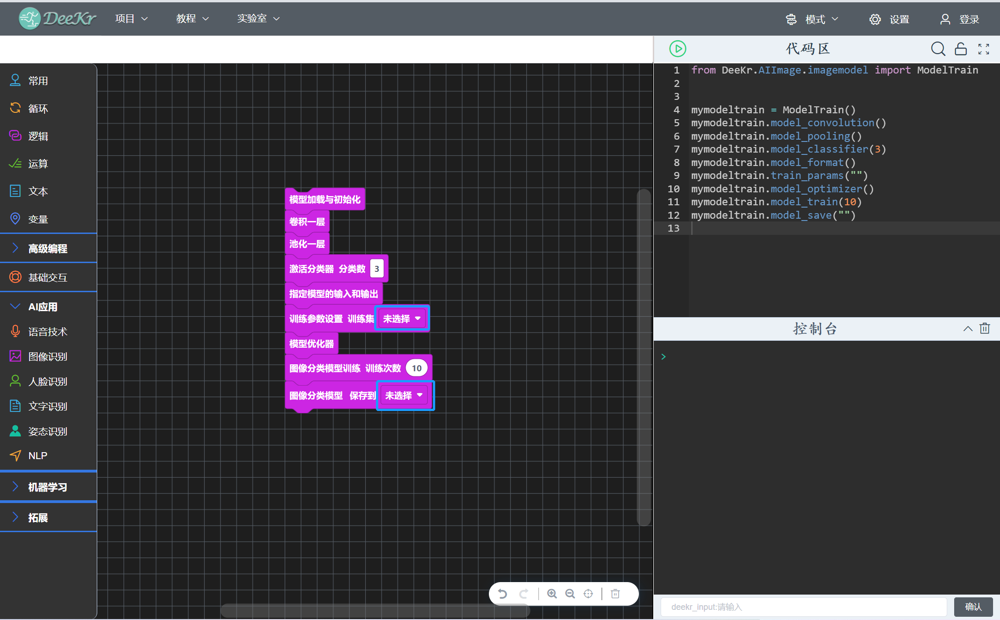