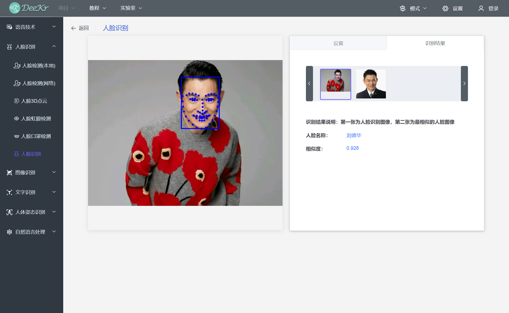
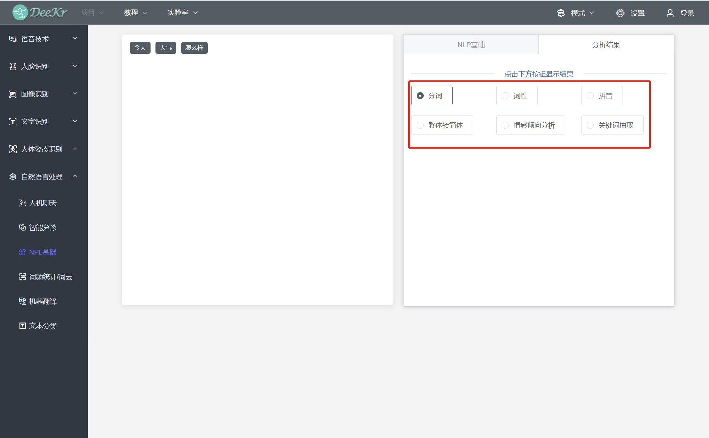

.. toctree::
  :maxdepth: 8

点击“实验室菜单栏”中的“AI体验”，即可进入AI体验平台。

1.语音识别
=========================
首先进行音频录制（可设置录音时长或结束录音），录音完成后点击“语音识别”按钮，即可获取语音识别结果；该应用运行时需要网络。

2.语音合成
=========================
首先输入待合成的文本，或者选择默认文本；完成后点击“语音合成”按钮，即可播放该文本的合成语音。

3.人脸检测
=========================
人脸检测（本地）、人脸检测（网络）、人脸3D点云、人脸虹膜检测、人脸口罩检测的操作步骤类型，本手册以人脸口罩检测为例：
首先需要导入待检测图片，图片的导入支持三种方式：摄像头拍摄、从本地上传、默认图片；若选择“摄像头拍摄”，点击“打开摄像头”，调整好待拍摄物体后，点击“拍照”按钮即可；若选择“从本地上传图片”，根据文件路径选择器，选择本地图片上传即可；若选择“默认图片”，根据默认图片列表选择图片导入即可。

完成待检测图片导入后，点击“开始识别”按钮，即可获取人脸口罩检测结果。

.. figure:: 23.人脸口罩检测2.png

4.人脸识别
=========================
（1）创建人脸数据：
首先需要新建人脸数据库，点击“新增”按钮，新增第一个人员；

在对话框中输入人员名称，输入完成后点击“确定”按钮；

人员列表显示已完成第一个人员的新建，此时该人员的人脸数据数量为0，点击“添加数据”按钮，为该人员添加人脸数据；

人脸数据的添加支持三种方式：默认图片、本地上传图片、拍照；若选择“默认图片”，根据默认图片列表选择图片导入即可；若选择“本地上传图片”，根据文件路径选择器，选择本地图片上传即可；若选择“拍照”，系统自动弹出摄像头画面，调整好待拍摄物体后，点击“拍照”按钮即可。 
若需要删除已经添加的人脸数据，将鼠标移动到该人脸图片上，系统自动显示“删除”图标，点击该“删除图片”即可完成人脸数据删除。

此时已经为第一位人员添加2张人脸数据图片，采用以上步骤继续新增其他人员的人脸数据。

（2）导出人脸数据：“导出人脸数据”的目的是在AI交互编程模式中直接使用已采集的人脸数据，点击“导出”按钮后选择“导出路径”即可在相应路径生成人脸数据文件夹；该人脸数据文件夹的使用方法将在“AI交互编程模式”章节中阐述。

（3）人脸识别：点击“启动人脸识别”按钮后进入“人脸识别”页面，测试图片导入方式与“人脸检测”类似，此处不再阐述；导入测试图片后，点击“开始识别”按钮，即可获取人脸识别结果。

5.图像识别
=========================
“物体识别”、“人像分割”、“微码识别”体验步骤与“人脸检测”类似，此处不再详细阐述；其中“维码识别”支持条形码识别和二维码识别；
“图像风格迁移”应用中，点击“启动”按钮即可进行体验；按下键盘“Enter”按键即可切换不同的图像风格；点击“关闭”按钮即可结束体验。

“二维码生成”应用中，首先输入文本或者上传文本，完成后点击“生成二维码”即可生成不带中心图片的二维码；若需要生成带中心图片的二维码，在完成文本输入或导入后，需要导入二维码中心图片；图片导入支持“摄像头拍摄”、“本地上传”、“默认图片”三种方式；图片导入后点击“生成二维码”按钮即可生成带中心图片的二维码。

6.文字识别
========================
“印刷体文字识别”、“车牌识别”体验步骤与“人脸检测”类似，此处不再详细阐述。
“手写体文字识别”应用中，在画板中手写文字后，点击“开始识别”按钮即可获取识别结果，该应用运行时需要网络；
“手写数字识别”体验步骤与“手写体文字识别”类似，该应用运行时不需要网络，此处不再详细阐述。

“生僻字识别”应用中，点击“选择默认图片”按钮，选择待识别的生僻字；选择完成后即可获取识别结果。

7.人体姿态识别
=========================
“手势识别”、“人体关键点检测”体验步骤与“人脸检测”类似，此处不再详细阐述。
“超级马里奥”、“虚拟试衣”、“俯卧撑计数”、“仰卧起坐计数”、“跳绳计数”体验步骤与“图像风格迁移”类似，此处不再详细阐述。

8.自然语言处理
=========================
“人机聊天”应用中，输入内容后点击“发送”按钮，即可获取机器聊天结果。
“智能分诊”体验步骤与“人机聊天”类型，此处不在详细阐述。

“NLP基础”应用中，在输入框中输入文本后，点击“分析”按钮，可选择获取“分词”、“词性”、“拼音”、“繁体转简体”、“情感倾向分析”、“关键词抽取”等不同的NLP分析结果。
“词频统计/词云”、“机器翻译”、“文本分类”体验步骤与“NLP基础”类似，此处不再详细阐述。

