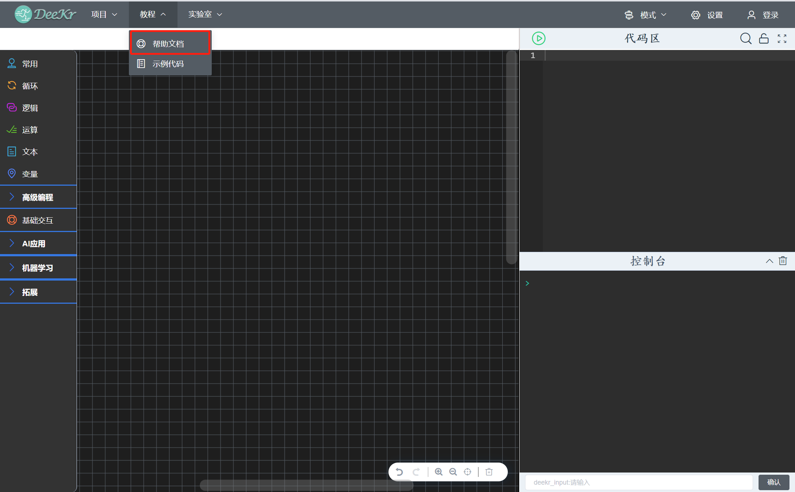
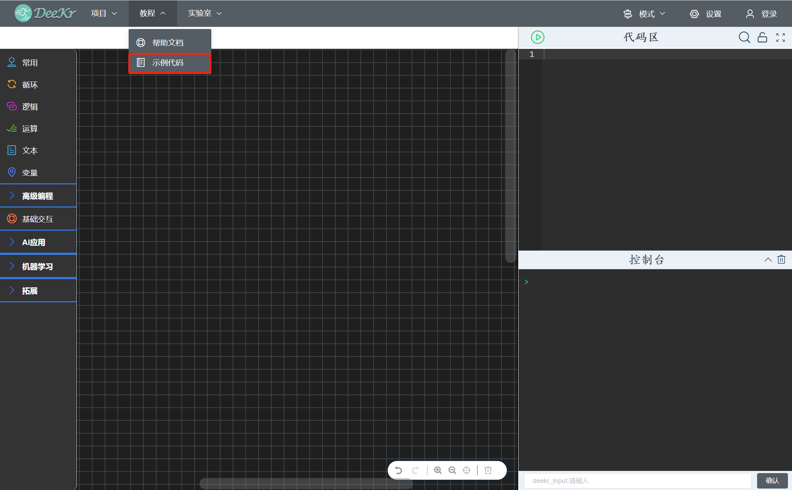
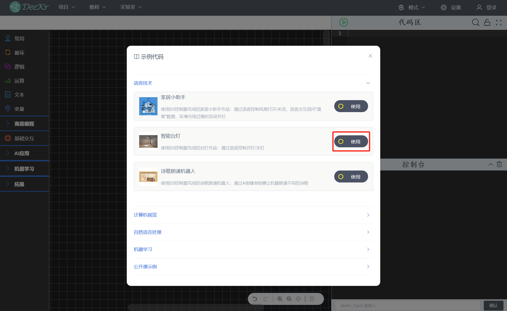

二、教程菜单栏
=====================================

.. toctree::
  :maxdepth: 2

1.帮助文档
=================================
在联网状态下，点击“教程菜单栏”中的“帮助文档”，即可查看本手册。

2.示例代码
=================================
在联网状态下，点击“教程菜单栏”中的“示例代码”，即可显示示例代码列表；选择对应的示例代码后，点击“使用”按钮，即可导入该示例代码；AI交互编程模式和硬件编程模式所提供的示例代码不同。

  
  

  
