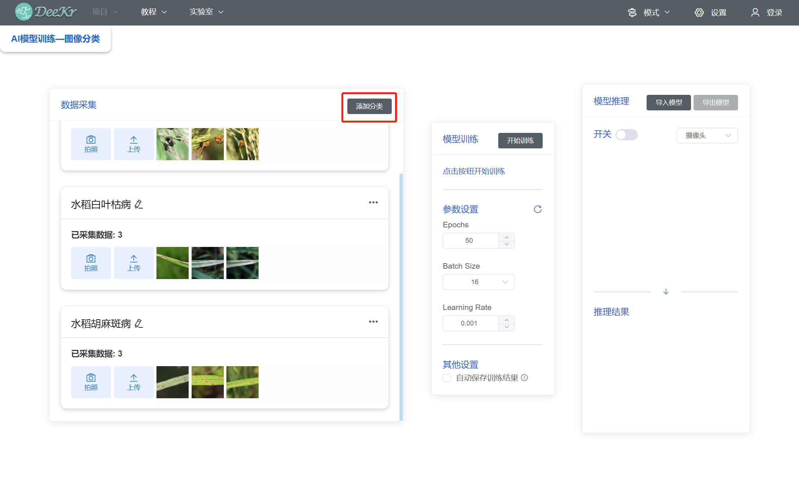

.. toctree::
  :maxdepth: 2

点击“实验室菜单栏”中的“AI模型训练”，即可进入AI模型训练平台。

1.图像分类
=================================
在主页面中点击“图像分类”，进入“图像分类”模型训练平台；
（1）数据采集和打标：
首先进行第一类数据的采集和打标，通过“拍照”或“上传本地图片”的形式，添加第一类数据；并点击“标签编辑”按钮，为该类别打标签；本平台的摄像头图片均支持镜像翻转（通过摄像头画面右上角“翻转”按钮实现）；

依次类推，完成其它类别的数据采集与打标；可通过“添加分类”按钮添加更多的类别。

（2）数据管理：针对每个类别的数据，可通过“设置”按钮进行“删除类别”、“禁用类别”、“清空数据库”、“下载到本地”等操作；“下载到本地”的目的是在AI交互编程模式中直接使用已采集的图像数据，点击“下载到本地”按钮后选择“导出路径”即可在相应路径生成图像数据文件夹；该图像数据文件夹的使用方法将在“AI交互编程模式”章节中阐述。

（3）模型训练：点击“开始训练”按钮即可进行模型训练，训练参数可采用默认参数或者自定义参数，等待训练进度条完成即可；

（4）模型推理：模型训练完成后，即可进行模型推理；支持开启摄像头进行实时图像的推理，或者上传图片文件进行推理；从“文件推理”方式切换为“摄像头推理”方式后，需要手动打开摄像头开关按钮。

.. figure:: 57.图像分类5.png

（5）模型导出：点击“导出模型”按钮，支持导出“ideekr模型”或者“Keras模型”到本地路径；其中“ideekr模型”支持在本“AI模型训练—图像分类”平台导入使用（详见下部分“模型导入”）；其中“Keras模型”支持在AI交互编程模式中使用，Keras模型的使用方法将在“AI交互编程模式”章节中阐述。

（6）模型导入：平台支持直接导入已训练好的模型进行推理，不需要再次进行“数据采集”、“模型训练”操作；点击“导入模型”按钮，选择模型位置后，完成模型导入；模型导入后，可进行“摄像头推理”或者“图片文件推理”，“摄像头推理”时需手动打开摄像头开关按钮。

