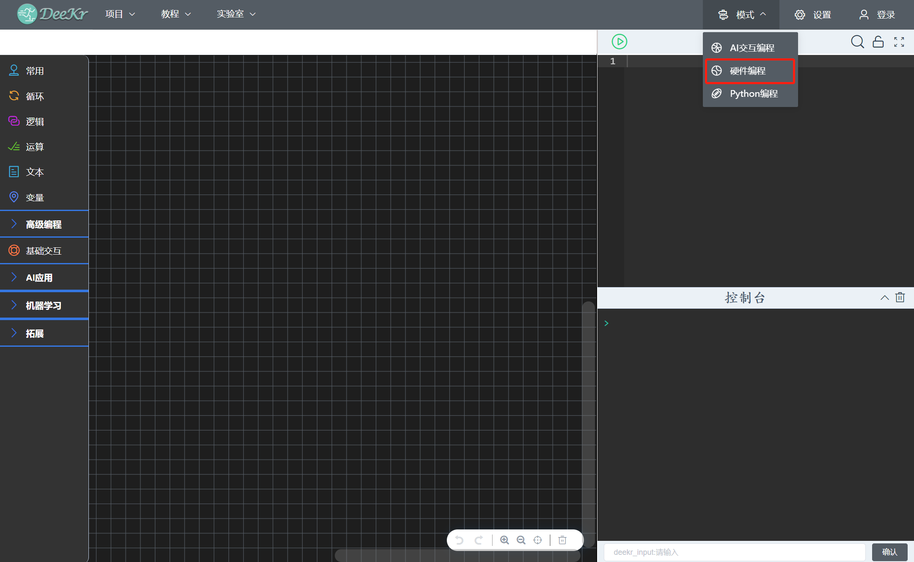
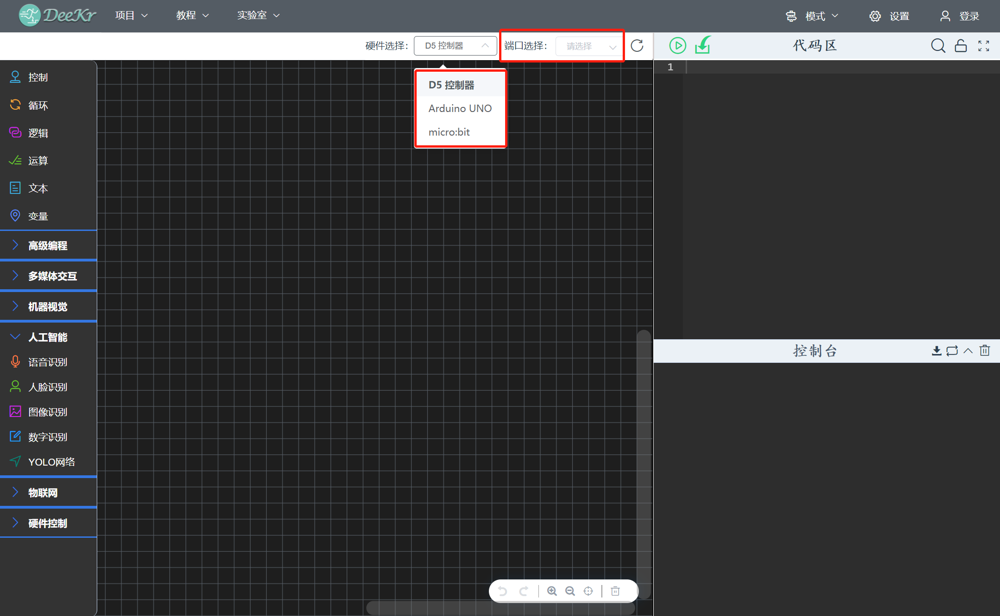

八、硬件编程模式
=====================================

.. toctree::
  :maxdepth: 11

点击“模式菜单栏”中的“硬件编程”，即可进入硬件编程模式；硬件编程模式可将程序直接上传到硬件控制板，程序上传后可脱离电脑运行。

进入“硬件编程模式”后，在硬件选择中，选择不同的硬件类型后，软件自动加载出该硬件类型的图形化编程积木；“硬件编程模式”操作方法与“AI交互编程模式”类型，此处不在详细阐述；用户可通过“教程菜单栏”中的“示例代码”获取示例资源。
用户将硬件连接到电脑USB后，软件自动显示“硬件已连接信息”；用户编写程序后，选择硬件端口，上传程序即可。

