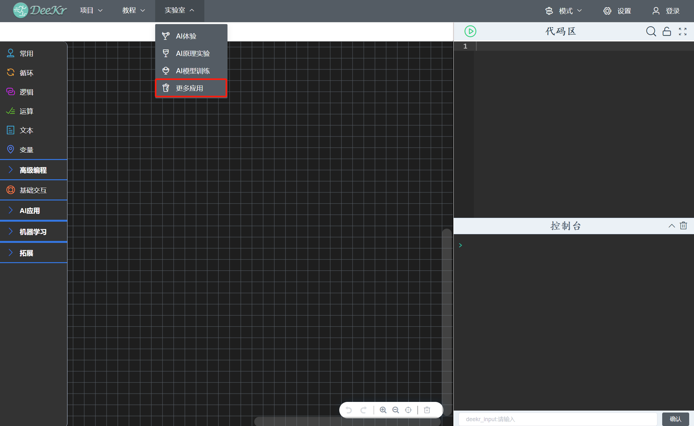
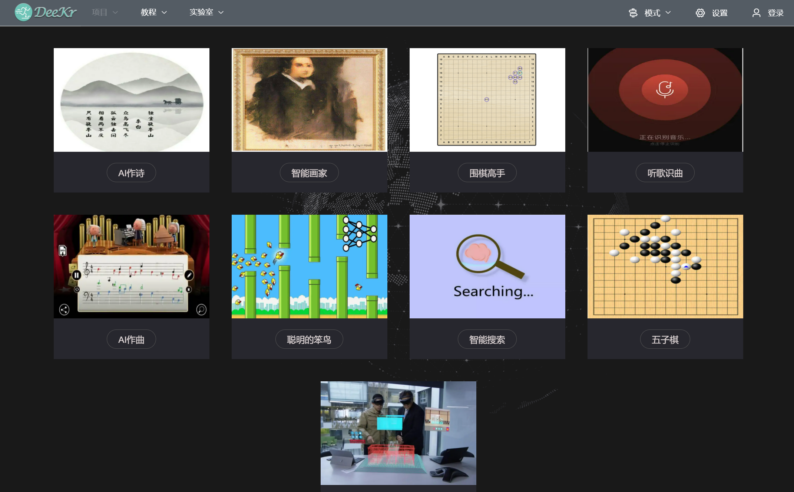
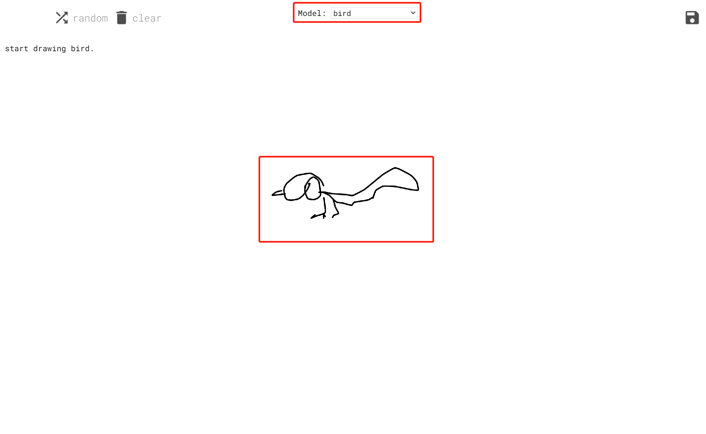
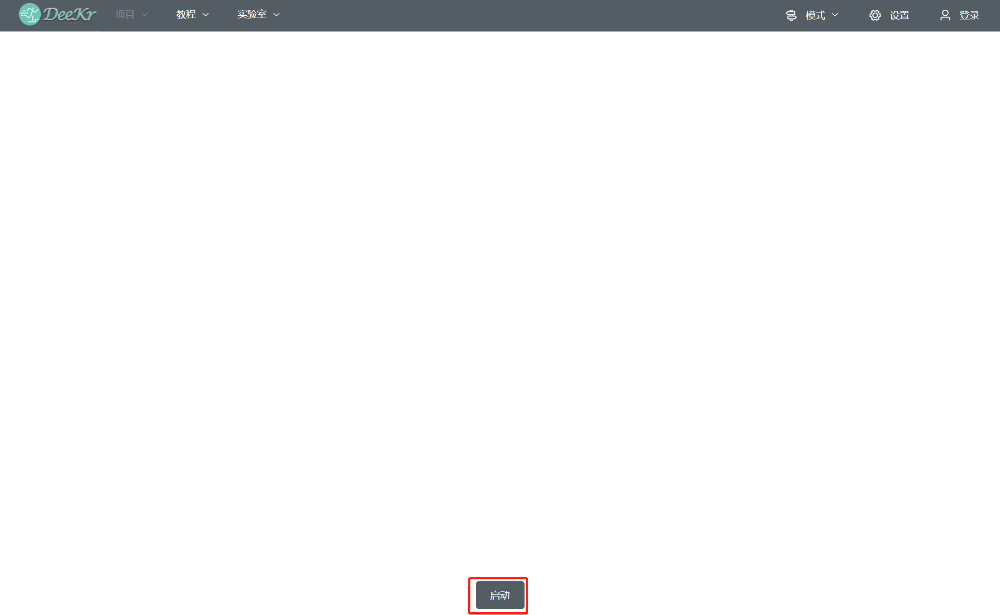
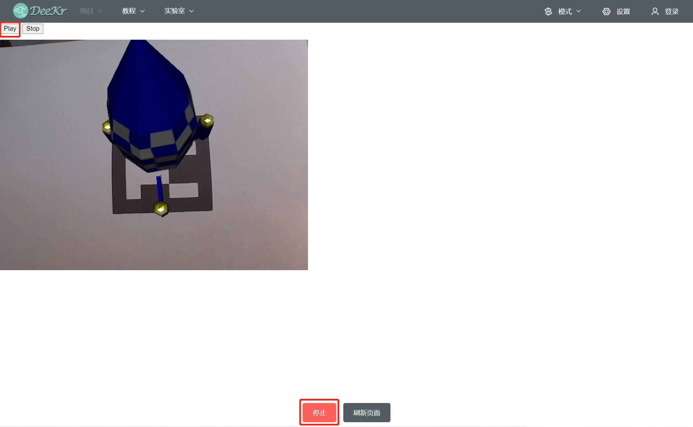

六、更多应用（实验室）
=====================================

.. toctree::
  :maxdepth: 2

点击“实验室菜单栏”中的“更多应用”，即可进入更多应用平台；其中“AI作诗”、“围棋高手”、“听歌识曲”、“AI作曲”、“聪明的笨鸟”、“智能搜索”、“五子棋”进入应用后操作易于理解，此处不再详细阐述。

1.智能画家
=========================
从主页面点击“智能画家”按钮，进入“智能画家”应用；首先选择待作画的模型（如”bird”）；接在在作画区画一小部分内容，系统将在这部分内容的基础上将画补充完整（如画出一只完整的”bird”）。

2.AR
=========================
从主页面点击“AR”按钮，进入“AR”应用；首先点击“启动”按钮，在弹出的画面中，点击“Play”按钮，将显示摄像头画面；将特定二维码图片（该图片可从课程资源中获取）放置在摄像头前，将在二维码图像上自动生成一个旋转的火箭；可通过调整二维码角度从而调整火箭的显示角度。

