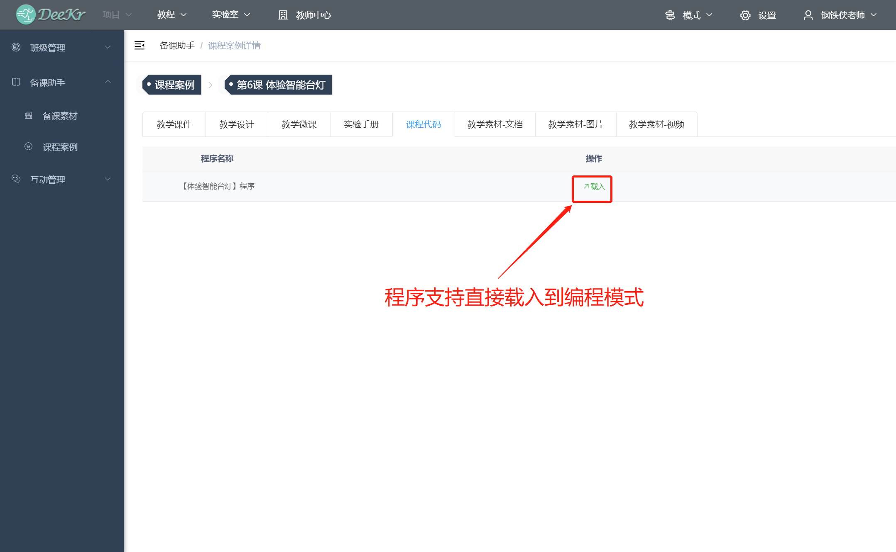
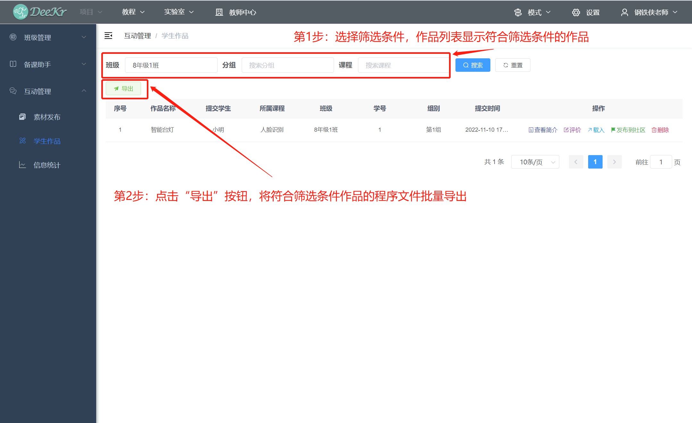

.. toctree::
  :maxdepth: 11

1.教师账号注册
=========================
教师可直接联系我司工作人员，由我司工作人员在后台创建教师账号即可；
教师若需自行注册账号，点击“登录”首页的“注册教师账号”按钮后，填写相关信息后，点击“注册”按钮提交注册信息；由我司工作人员审核后，教师自行注册的账号即可生效。

2.教师账号登录
============================
教师在“登录”首页中输入用户名和密码后，点击“登录”按钮后，即可完成用户登录；登录完成后点击“教师中心”按钮即可进入教师中心主界面。

.. figure:: 85.教师登录2.png

3.教师账号重置密码
============================
教师在“登录”首页点击“重置密码”按钮，通过手机号验证码即可重置密码。

.. figure:: 87.教师找回密码2.png

4.班级管理
=============================
(1)新增班级：点击“新增”按钮，班级的新增支持“单独创建”和“批量创建”两种方式。

(2)删除班级：通过班级列表中的“删除班级”按钮，即可删除对应班级。

(3)查看班级学生：通过班级列表的“查看学生”按钮，即可查看该班级学生。

5.学生管理
=============================
(1)创建新的学生账号：点击“新增”按钮，创建新的学生账号支持“单独创建”和“批量创建”两种方式。

(2)将已有的学生账号添加到班级：当学生已有账号，需要将其账号添加到班级时，点击“新增”按钮，支持“单独添加”和“批量添加”两种方式。

(3)学生删除：通过学生信息列表中的“删除学生”按钮，即可删除学生。

(4)学生信息查看：通过学生信息列表中的“详情”按钮，即可查看详细学生信息。

(5)学生密码修改：通过学生信息列表中的“修改密码”，即可修改学生账户密码。

(6)学生信息批量导出：筛选班级，学生信息列表显示符合筛选条件的学生账号；点击“导出”按钮，即可导出所筛选学生的信息。

6.班级学生分组和分角色
=================================
创建班级以及添加学生后，可进一步进行班级学生分组和分角色；该功能可根据实际情况选择是否使用，不使用该功能不影响后续的“素材发布”、“学生作品”等功能使用。
(1)查看已完成分组的学生：在班级列表中点击“分组”按钮，即可查看该班级已完成分组的学生。

(2)自定义组别名称：在分组学生列表中，点击“编辑组别”按钮后，通过“自定义分组”按钮即可自定义组别名称；点击“新增”按钮，填写新增的组别名称即可；自定义的组别名称与教师账号关联，教师完成一次组别名称自定义后，以后进行学生分组时即可直接使用。

(3)自定义角色名称：在分组学生列表中，点击“编辑组别”按钮后，通过“自定义角色”按钮即可自定义角色名称；点击“新增”按钮，填写新增的角色名称即可。自定义的角色名称与教师账号关联，教师完成一次角色名称自定义后，以后进行学生分组时即可直接使用。

(4)学生分组和分角色：按以下步骤完成学生分组和分角色，其中组别名称和角色名称需要自定义（详见上部分）；已自定义过的组别名称和角色名称可直接使用，不需要每次都进行自定义。

7.查看备课素材
================================
选择主题后，查看文档、图片、视频等备课素材。

8.查看课程案例
=================================
选择课程后，查看教学课件、教学设计、教学微课、实验手册、课程代码、教学素材等教学资源。

9.教学素材发布
=================================
(1)分配课程:点击“课程分配”按钮，进行课程分配页面后，点击“新增”按钮，选择该课程所属的班级，并输入新增课程的名称后，点击“确定”按钮即可。

(2)发布素材：在“素材发布”页面中，点击“发布素材”按钮后，选择素材的发布班级/组别/课程后，上传需要发布的素材文件，点击“确定”按钮后，即可向所选群体的学生发布课堂素材。

(3)管理已发布成功的素材：在“素材发布”页面中即可查看以发布成功的素材信息，可通过“删除”选项对素材进行管理。

10. 学生作品管理
===================================
1.查看学生作品：在“学生作品”页面中即可查看所接收到的学生作品的信息。

2.评价学生作品：在对应的学生作品中，点击“编辑评价”按钮，即可对该作品进行评价编辑；学生可实时查看教师评价内容。

3.发布学生作品到作品社区：在对应的学生作品中，点击“发布到社区”按钮，即可将该学生作品发布到作品社区；学生可在“作品社区”栏目查看到教师所发布的作品。

4.学生作品批量导出：筛选班级/分组/课程，学生作品列表显示符合筛选条件的学生作品；点击“导出”按钮，即可批量导出所筛选作品的程序文件。

11. 信息统计
====================================
在“信息统计”页面，可查看目前以创建的班级数量、课程数量、素材发布素材、接收的学生作品数量；通过可视化图表的方式呈现当前不同班级的学生作品提交情况，以及不同班级的素材发布。

