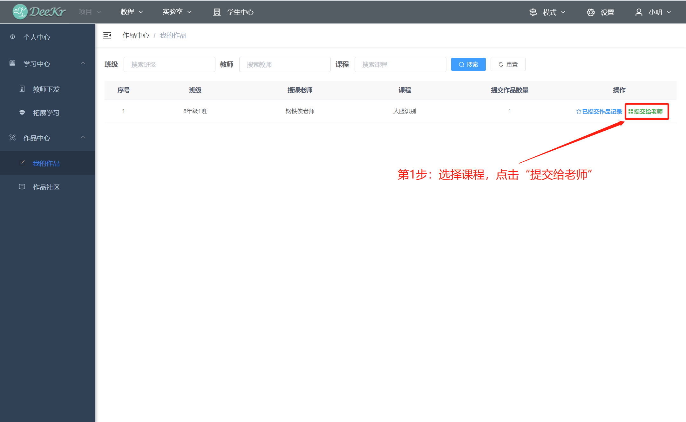

.. toctree::
  :maxdepth: 11

学生账号登录
===========================
学生采用教师提供的账号登录本软件；在首页输入账号名和密码后，点击“登录”按钮后，即可完成学生用户登录；登录完成后点击“学生中心”按钮进入主页面。

学生个人中心
===========================
选择进入“个人中心”子页面后，即可查看相关个人信息（账户名、姓名、性别、学校、账户创建日期、班级、学号、分组、角色）

学生学习中心
============================
(1)查看已加入课程：课程列表显示该学生账号已经加入的班级/课程信息；

(2)查看某课程的教师下发文件：对课程列表中的某个课程点击“查看”按钮，即可查看该课程的教师下发文件；程序文件通过“载入”按钮可直接在编程模式打开查看；Word、PDF、Excel、PPT格式文件可直接点击查看；其它特殊格式文件下载到电脑本地后查看。

4.学生作品提交
=============================
(1)查看已加入课程：课程列表显示该账号已经加入的课程信息，以及在该课程的已提交作品数量；

(2)提交作品：对课程列表中的某个课程点击“提交给老师”按钮，即可进入作品提交页面；从本地选择程序文件，并填写该作品程序的简介，完成后点击“确定”按钮即可完成作品提交；

(3)管理已提交的作品:
对课程列表中的某个课程点击“已提交作品记录”按钮，即可查看该课程已提交作品的记录；在对应的作品中，点击“编辑”按钮，即可修改该作品的作品名称和作品简介；在对应的作品中，点击“查看老师评价”按钮，即可查看教师对于该作品的评价；在对应的作品中，点击“载入”按钮，即可查看该作品程序的内容；在对应的作品中，点击“删除”按钮，即可删除该作品程序。

5.学生作品社区
==============================
作品社区的优秀作品由教师分享形成，作品列表即可查看该作品信息（包含作品名称、作者、作者班级、授课老师、所属课程等信息）；在对应的作品中，点击“查看简介”按钮，即可查看该作品作者为该作品填写的简介内容；在对应的作品中，点击“查看老师评价”按钮，即可查看教师为该作品填写的评价内容；在对应的作品中，点击“载入”按钮，即可在编程模式载入查看该作品程序。

