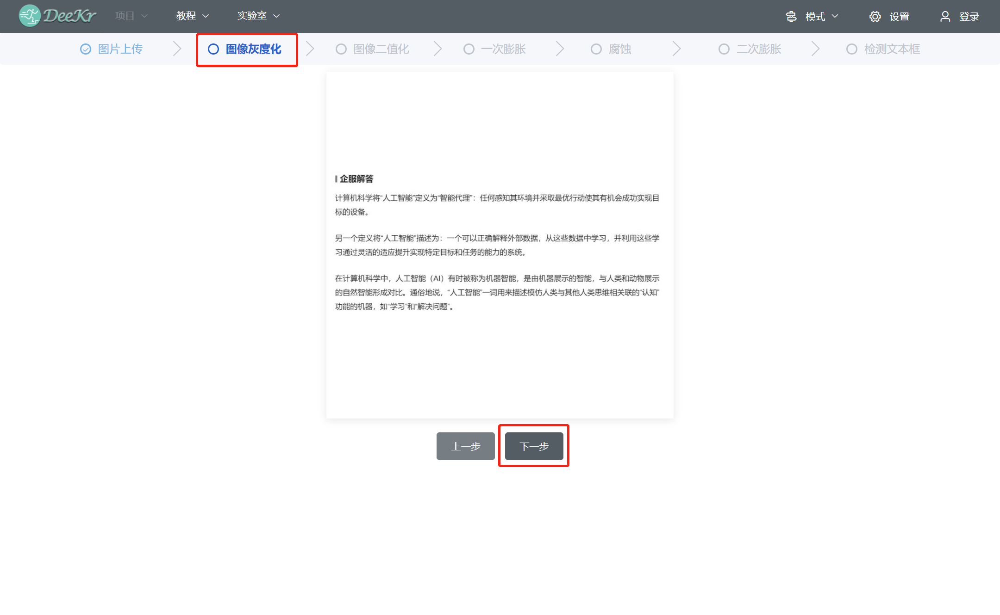

四、AI原理实验平台
=====================================

.. toctree::
  :maxdepth: 2

点击“实验室菜单栏”中的“AI原理实验”，即可进入AI原理实验平台。

以“文本检测”为例阐述实验步骤：在主页面中点击“文本检测”，即可进入“文本检测”原理实验；首先是步骤一“图片上传”，图片上传方式支持“摄像头拍摄”、“从本地上传图片”、“选择默认图片”；完成后点击“下一步”按钮，即可进入步骤二“图像灰度化”；以此类推，通过“上一步”和“下一步”按钮即可进入相应的实验步骤。

